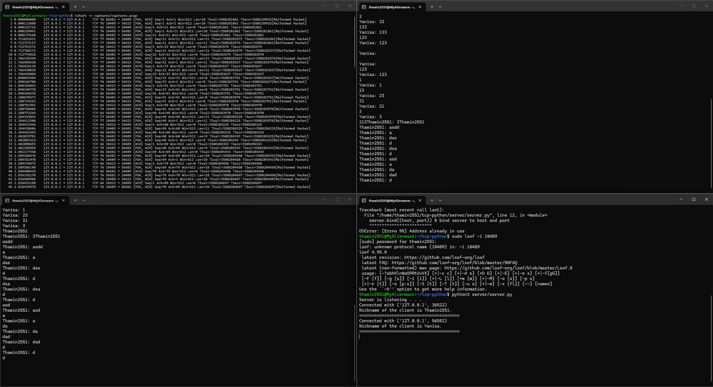

# TCP Group Chat (Python)

## Overview
The purpose of this project is hands-on throught the networking theory 
e.g. tcp/ip udp thread

## Motivation
Why i choose this project with Python - i have ever done this project with C before, but i realize i don't familiar with the syntax
so i end up and start over with python

## Architecture
- Server-Client model: TCP
- Server use threading for multiple client
- Client has each thread for send and recieve message

## Concepts
### TCP 3-way Handshake
- client.connect() -> SYN
- server.accept() -> SYN ACK
- client.receive() -> ACK

### Threading for Multi-client
*** Without Threading ***
The server can only handle 1 Client at a time - 'server.accpet()' - and will block other client that try to send message
so this make a group chat impossible to wait 1 client finish their task like a talking to that client before accepting the next one

- Server side: every time receive_connection() accepts a new client, 
  a new thread is spawned via threading.Thread(target=handle, args=(client,)). 
  This lets handle() run independently for each client — one client's 
  slow network or long recv() wait never blocks the others.

- Client side: two threads run in parallel — one thread (receive_message()) 
  continuously listens for incoming broadcasts, while the main thread 
  (write_message())

### Encoding/Decoding
When Client send or receive message from each other.The encode and decode is very important,
because the data that sent through network in physical layer is bit or bytes
so it's nescessary to encode or decode every single time before send or receive message

## How to Run
### Server
\`\`\`bash
python3 server.py
\`\`\`

### Client (You can split terminal and run command manually)
\`\`\`bash
python3 client.py
\`\`\`

## Testing & Evidence
- 
- Wireshark (CLI) capture result while client connect and send message to each other

## Bugs Found & Fixed
- Fix clients.close() to client.close()
- Change the eth0 to lo (loopback) - traffic on 127.0.0.1 didn't pass through the Ethernet Layer. The OS kernel routes loopback traffic directly without 
  building an Ethernet frame, so eth0 never sees this traffic even on the same machine.

## Limitations
- No encryption — Send a message in plaintext format (Wireshark)
- might have a problem if many client send a message in a row
- No validate input from client (such as duplicate nickname)

## Future Improvements
- AES encryption for plaintext message (Crypthography)
- Prevent Duplicate nickname
- Add Feature private message between 2 Client
- Move Python to C with same socket project to practice manage or allocate memory manaully
